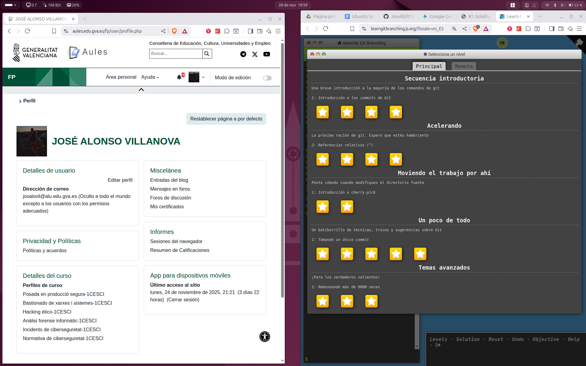
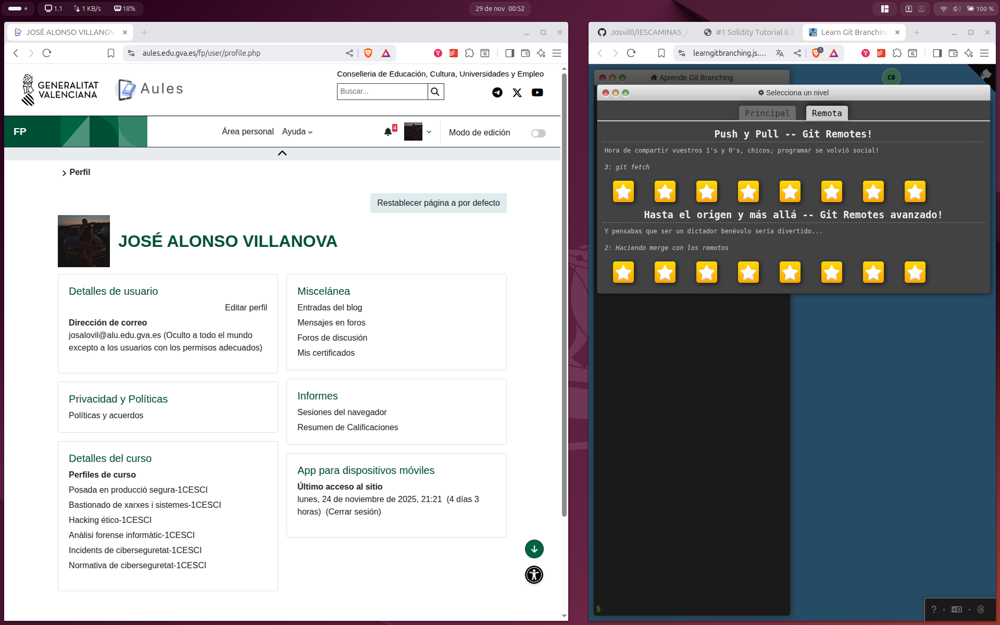

# 📸 Apartado 3: Evidencia del Tutorial LearnGitBranching

## 📝 Descripción

Este apartado presenta las evidencias fotográficas requeridas después de haber completado el tutorial interactivo **"Learn Git Branching"** (URL: `https://learngitbranching.js.org/`).

El objetivo es demostrar el dominio de los conceptos avanzados de **Git**, como la gestión de ramas locales y remotas (`main`, `master`, *feature branches*), y la manipulación del historial (*rebase*, *cherry-pick*).

Se han obtenido dos capturas de pantalla:
1.  **Pestaña Principal (Main):** Muestra el estado final de los ejercicios de la sección principal.
2.  **Pestaña Remota (Remote):** Muestra el estado final de los ejercicios relacionados con la interacción remota (*push*, *pull*, *fetch*).

***

## 🖼️ Evidencia Fotográfica

Para demostrar que los resultados son propios y no imágenes aleatorias, la hora y fecha del sistema operativo se han capturado junto a la interfaz del tutorial.

### 1. Pestaña Principal (Main) - Eje Local

**Resultado del historial local completado.**

### 2. Pestaña Remota (Remote) - Eje Remoto

**Resultado del historial remoto completado.**

***
