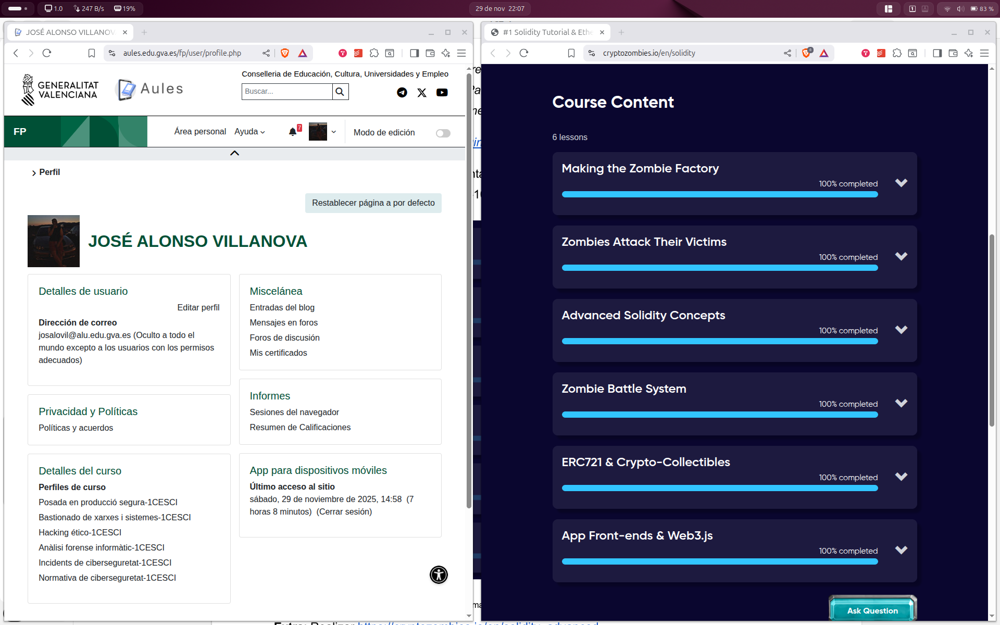

# ⛓️ Apartado 4: Solidity, Tutorial y Merkle Root

## 📝 Descripción

Este apartado consta de dos partes: la evidencia de la finalización del tutorial de Solidity y la implementación de un Smart Contract propio que sirve como punto de partida para una cadena que utiliza la verificación por **Árboles de Decisión de Merkle (Merkle Trees)**.

***

## 1. 🖼️ Evidencia del Tutorial de Solidity

Se adjunta una captura de pantalla que demuestra la finalización del tutorial **"Solidity: Beginner to Intermediate Smart Contracts"** de la práctica ACT_RA1_4.

### Captura de Pantalla

***

## 2. 🔐 Smart Contract: Cadena de Decisión Merkle (`Merkle.sol`)

El requisito es crear el "inicio de una cadena que utilice los árboles de decisión de Merkle". Para cumplir con esto de forma eficiente y simple, se ha implementado el contrato **`Merkle.sol`**.

### Características del Contrato

1.  **Inicio de Cadena:** Almacena la **`merkleRoot`** (`bytes32`), que es la clave que certifica el estado de todos los datos fuera de la cadena. 
2.  **Contrato Privado:** El *modifier* **`onlyOwner`** restringe quién puede actualizar la raíz, garantizando el control de la cadena de confianza.
3.  **Simulación:** La función `verifyDecision` es un **marcador de posición conceptual**.